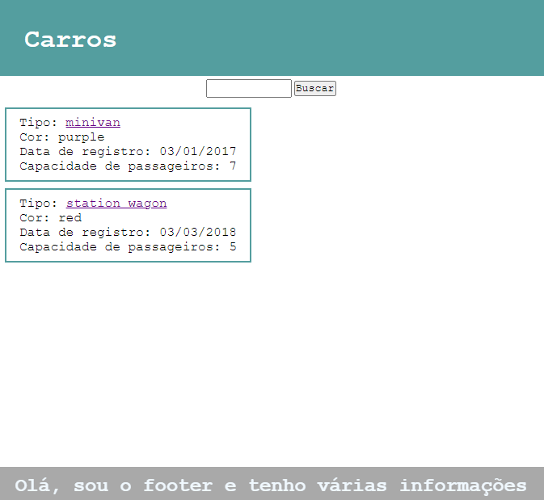

1. Crie uma página HTML, e nesta página, dê um título para sua lista de itens;
2. Crie um cabeçalho, uma seção principal, e um footer para a página;
3. Na seção principal. Crie duas divisões. Uma deve possuir um input e um botão. A outra, deve possuir sections para criar os itens da lista;
4. Crie uma section para cada item da lista;
5. Para cada um dos três itens criados deve possuir todas as informações do array de objetos. As informações devem estar elencadas como lista não ordenada. Esta tela não precisa interagir com o JavaScript, tendo seus dados escritos diretamente nos elementos.
6. Transforme o nome/título do item em um link para um artigo sobre este item (pode ser do google, de algum blog ou da Wikipédia)

Recomendamos adicionar imagens a seus itens agora. Ao fazer isso, lembre-se de criar mais uma propriedade String nos seus objetos, para guardar o caminho do link até a imagem.

Se baseando no nosso exemplo de estilização, crie a identidade da sua página seguindo os passos abaixo:

1. Estilize o cabeçalho da sua página com o mesmo título que está no <title>;
2. Estilize o rodapé para sua página, e nele, coloque suas informações de contato (nome e github);
3. Estilize a lista criada na semana passada, seguindo o padrão enviado;

Você não precisa seguir exatamente os mesmos tamanhos, fontes e cores da página de exemplo, mas é importante que os elementos estejam presentes (cabeçalho, rodapé, barra de pesquisa etc).