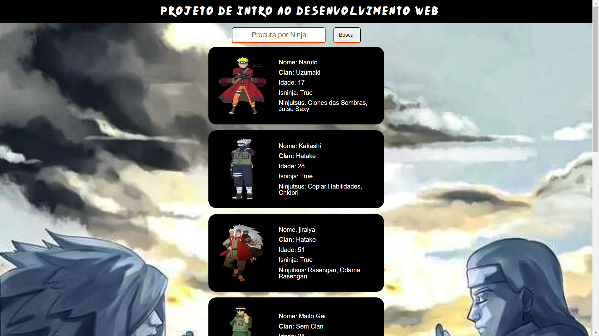
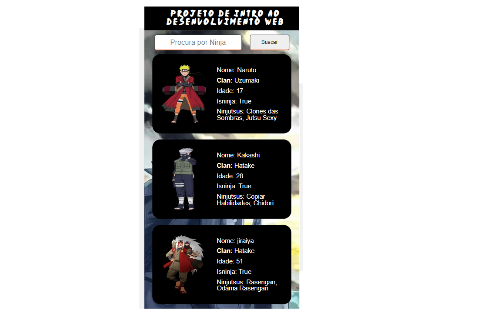

<h1 align="center"> Projeto de Introdução ao desenvolvimento web  
 
</h1>

  <a href="#Tecnologias">Tecnologias</a>&nbsp;&nbsp;&nbsp;|&nbsp;&nbsp;&nbsp;
   <a href="#Projeto">Projeto</a>&nbsp;&nbsp;&nbsp;|&nbsp;&nbsp;&nbsp;
  <a href="#Instalação">Instalação</a>&nbsp;&nbsp;&nbsp;|&nbsp;&nbsp;&nbsp;
  <a href="#Imagens">Imagens</a>&nbsp;&nbsp;&nbsp;|&nbsp;&nbsp;&nbsp;
  <a href="#Integrantes">Integrantes</a>&nbsp;&nbsp;&nbsp;&nbsp;&nbsp;&nbsp;

## 🚀 Tecnologias 

Esse projeto foi desenvolvido com as seguintes tecnologias:

- HTML 5
- CSS 3
- JavaScript

## 💻 Projeto

Esse é o projeto de introdução aos fundamentos do desenvolvimento Web. Aqui, foi praticado tudo que foi passado ao logo do curso de HTML, CSS e Javascript. O objetivo foi construir uma página estilizada, e com **lista** e **busca** utilizando manipulação de DOM, praticando o conteúdo do módulo com JavaScript, HTML5 e CSS3:

- Variáveis
- Operadores
- Strings
- Arrays
- Objetos
- Condicionais
- Laços
- Funções
- Funções de Array
- HTML e CSS
- Flex e Grid
- DOM e responsividade

## Link surge  
[Live Demo -> Projeto Naruto Shippuden](https://half-design.surge.sh/)

## 👨‍💻 Instalação

1. Faça o dowload e extração do projeto;
2. Abra o arquivo index.html com seu navegador;
3. Pronto, agora é só testar a aplicação.
### Imagens

## 🖼️ Imagens
 ## HomePage

 ## HomePagePhone

## 💼 Construído por: 

- Célio Cleiton - [LinkeDin](https://www.linkedin.com/in/c%C3%A9lio-cleiton-39709249/)

O que funciona:

- Home
- Página de detalhes

O que não funciona: 

- No campo de buscar, após digitar o nome do ninja escolhido, pressionar o enter não funciona, nesse caso você tem de clicar no botão de busca.

<h1 align="center"> 👋 Até a próxima Dattebayo  
 
</h1>